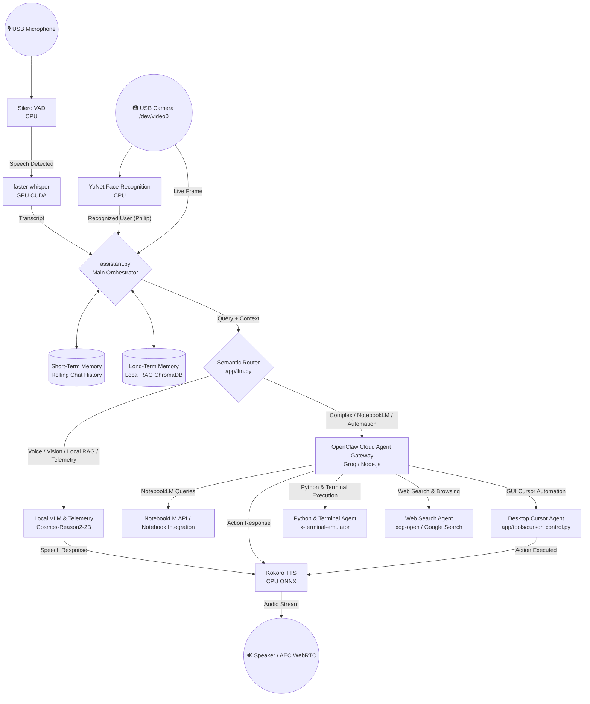

# 🤖 Aria Advanced Hybrid AI Assistant — Jetson Orin Nano Super

**Aria** is an autonomous, real-time, multimodal voice, vision, and desktop automation assistant designed for edge robotics and desktop productivity on the **NVIDIA Jetson Orin Nano (8GB / 67 TOPS)**.

It features an **Advanced Dual-Core Architecture**:
1. **Local Architecture (`LOCAL`)**: Real-time voice interaction, optical vision perception, desktop screenshot inspection, live system telemetry diagnostics, short-term rolling conversation history, and local vector RAG (`ChromaDB`).
2. **Cloud Architecture (`CLOUD`)**: Complex multi-step reasoning via **OpenClaw Agent Gateway**, NotebookLM querying, web search & browsing, python code runner, desktop mouse cursor navigation, and terminal execution.

---

## 🌟 Advanced Features & Functional Division

| Layer | System / Tool | Tech Stack | Functional Capabilities |
| :--- | :--- | :--- | :--- |
| **Local Model** | Voice & Optical VLM | `Cosmos-Reason2-2B-Q4_K_M` (`llama-server`) | Real-time voice conversation, camera vision perception (`/dev/video0`), desktop screenshot VLM inspection. |
| **Local RAG** | Vector Store Memory | `ChromaDB` / `app/rag.py` | Local domain knowledge base querying markdown documentation in `./knowledge_base/`. |
| **System Telemetry**| Diagnostics Engine | `psutil` / `app/tools/cursor_control.py` | Live monitoring of CPU, RAM, GPU load, and Jetson Orin Nano thermals. |
| **Short-Term Memory**| Rolling Conversation History | Deque Buffer (`assistant.py`) | Preserves multi-turn chat history across local and cloud interactions. |
| **Long-Term Memory**| Permanent Profile & RAG | `user_profile.md` + ChromaDB | Stores permanent user background, preferences, and project details. |
| **Cloud Agent** | OpenClaw Agent Gateway | OpenClaw / Groq Cloud | Multi-step agentic execution, NotebookLM notebook queries, and cloud tasks. |
| **Desktop Automation**| GUI Cursor & Media Agent | `PyAutoGUI` / `python-xlib` | Mouse cursor navigation, YouTube video thumbnail clicking, scrolling, and typing. |
| **Code Runner** | Python & Terminal Agent | `x-terminal-emulator` / Subprocess | Autonomous writing and execution of Python scripts and terminal commands. |
| **Voice Engine** | STT & TTS Pipelines | `faster-whisper` + `Kokoro-ONNX` | Ultra-fast GPU transcription + natural CPU voice synthesis with WebRTC AEC. |

---

## 📊 System Architecture & Workflow Flowchart



---

## 🧠 Advanced Tool & Voice Commands

### 1. Local Voice & Diagnostic Commands
- **"System status" / "Telemetry"**: Returns live CPU, RAM, and GPU load.
- **"Screenshot" / "What's on my screen"**: Captures current desktop image and feeds it to the local VLM for visual inspection.
- **"Who are you" / Conversational queries**: Answered locally via `Cosmos-Reason2-2B` with local RAG memory.

### 2. Cloud Agent & Automation Commands
- **"Open YouTube and play [song]"**: Moves cursor to video thumbnail on display and clicks play.
- **"Search online for [topic]"**: Opens browser web search for the query.
- **"Execute python [code]"**: Writes python code to file and executes it autonomously.
- **"Open terminal and run [command]"**: Spawns terminal window and runs command.
- **"Use NotebookLM and analyze [topic]"**: Connects to NotebookLM for deep notebook context retrieval.

---

## ⚙️ Quick Start

```bash
# Clone and start full assistant stack:
./launch_aria.sh
```

- **Dashboard**: `http://localhost:8090`
- **OpenClaw Gateway**: `http://localhost:19000`
- **Local LLM Server**: `http://localhost:8080`
