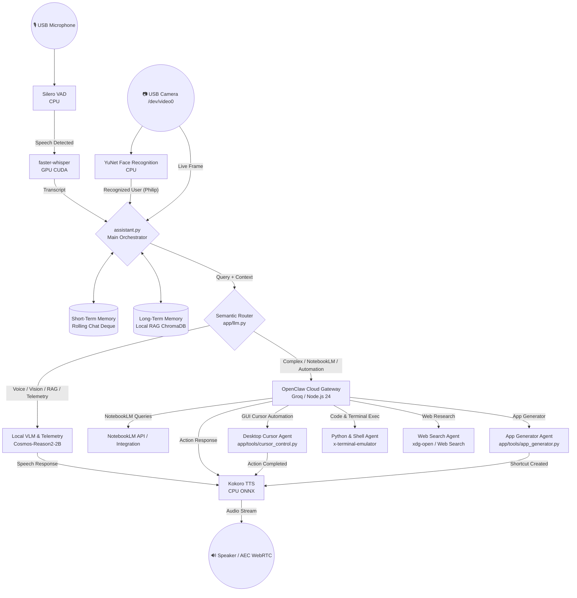

<div align="center">

  

  # 🤖 ARIA AI ASSISTANT 🤖

  ### **Autonomous Multimodal Voice, Vision, RAG & Desktop Automation Agent for NVIDIA Jetson Orin Nano**

  [](https://www.nvidia.com/en-us/autonomous-machines/embedded-systems/jetson-orin/)
  [](#-system-architecture--workflow)
  [](https://www.python.org/)
  [](LICENSE)
  [](https://github.com/FilippeZ)

</div>

---

## 📌 Overview

**ARIA AI ASSISTANT** is a state-of-the-art autonomous, real-time, multimodal voice, vision, local RAG, and desktop automation assistant designed for edge robotics and high-productivity desktop environments on the **NVIDIA Jetson Orin Nano (8GB / 67 TOPS)**.

ARIA combines local on-device neural processing with cloud agentic intelligence in an **Advanced Dual-Core Hybrid Architecture**:

1. **Local Core (`LOCAL`)**: 
   - Real-time voice interaction with GPU-accelerated STT (`faster-whisper`) and CPU-optimized TTS (`Kokoro-ONNX`).
   - Optical vision perception & YuNet facial detection/recognition to identify the owner (**Philip**).
   - Desktop screenshot inspection via local VLM (`Cosmos-Reason2-2B-Q4_K_M`).
   - Real-time system telemetry diagnostics (CPU, RAM, GPU load, thermals).
   - Local Vector RAG using `ChromaDB` for domain-specific knowledge base retrieval.
   - Rolling short-term conversation context deque.

2. **Cloud Core (`CLOUD`)**:
   - Multi-step agentic execution via **OpenClaw Agent Gateway**.
   - Autonomous desktop cursor navigation & PyAutoGUI control (mouse movements, clicks, scrolling, playback).
   - Local GUI Application Generator (`app_generator.py`) creating `.desktop` launchers on-the-fly.
   - NotebookLM deep research querying & structured markdown synthesis.
   - Autonomous web search & browsing agent.
   - Live Python code runner and terminal command execution (`x-terminal-emulator`).

---

## 🖥️ Live Assistant Interface in Action

Here is ARIA AI Assistant running in real-time on desktop with live voice interaction, system status monitoring, and agent execution:

<div align="center">
  
</div>

---

## 🖼️ Feature Highlights & Capabilities

### 🎬 1. Desktop GUI & Media Voice Automation
ARIA parses voice commands to control desktop GUI elements via `PyAutoGUI` and `python-xlib`. It can open media platforms (e.g., YouTube), locate UI targets, click buttons, type, and control playback seamlessly.

### ⚡ 2. Autonomous Local Desktop App Generator
Using the built-in `app_generator.py` tool, ARIA can automatically generate local custom GUI applications, shell scripts, and Linux `.desktop` desktop shortcuts on demand for instant executable access.

### 👁️ 3. Optical VLM Camera Perception & Face Recognition
Connects to USB camera devices (`/dev/video0`) to perform real-time YuNet face detection & feature matching (recognizing Philip) alongside local `Cosmos-Reason2-2B` VLM visual scene understanding and live screenshot analysis.

### 📚 4. Cloud Agent NotebookLM & Deep Web Research
Routes complex multi-turn reasoning and research queries through the OpenClaw Cloud Gateway, retrieving notebook knowledge from NotebookLM, performing live web searches, and rendering comparison tables.

### 🧠 5. Local RAG & Jetson Telemetry Monitoring
Performs high-speed vector search against an embedded `ChromaDB` vector store (`./knowledge_base/`) and provides real-time voice updates on CPU, RAM, GPU utilization, and Orin Nano thermals.

---

## 🌟 Technical Stack & Architecture Division

| Layer | System / Tool | Technology Stack | Functional Capabilities |
| :--- | :--- | :--- | :--- |
| **Local VLM Core** | Voice & Vision Engine | `Cosmos-Reason2-2B-Q4_K_M` (`llama-server`) | Voice conversations, live camera perception (`/dev/video0`), desktop screenshot VLM inspection. |
| **Local RAG** | Vector Memory | `ChromaDB` / `app/rag.py` | Local domain knowledge base querying markdown documentation in `./knowledge_base/`. |
| **System Telemetry**| Diagnostics Engine | `psutil` / `app/tools/cursor_control.py` | Real-time monitoring of CPU, RAM, GPU load, and Jetson Orin Nano thermals. |
| **Face Recognition**| Optical Perception | `YuNet` ONNX + OpenCV | Face tracking and biometric identification for Philip. |
| **Short-Term Memory**| Rolling History Buffer | Python Deque Buffer (`assistant.py`) | Preserves multi-turn conversation state across local & cloud turns. |
| **Long-Term Memory**| Permanent Profile | `user_profile.md` + ChromaDB | Stores permanent user background, preferences, and project details. |
| **Cloud Agent** | OpenClaw Gateway | OpenClaw / Groq LLMs | Multi-step agentic execution, NotebookLM queries, and cloud tasks. |
| **Desktop Automation**| GUI Cursor Agent | `PyAutoGUI` / `python-xlib` | Mouse cursor navigation, YouTube video thumbnail clicking, scrolling, typing. |
| **App Generator** | Desktop Creator Tool | `app/tools/app_generator.py` | Spawns custom Tkinter/Python apps and generates `.desktop` shortcuts. |
| **Code & Shell Runner**| Code Execution | `x-terminal-emulator` / Subprocess | Autonomous creation and execution of Python scripts and terminal commands. |
| **Voice Pipeline** | STT & TTS | `faster-whisper` + `Kokoro-ONNX` | Ultra-fast GPU transcription + natural CPU speech synthesis with WebRTC AEC. |

---

## 📊 System Workflow Architecture



---

## 📂 Repository Structure

```
aria-ai-assistant/
├── app/
│   ├── audio.py                # PyAudio recording & WebRTC AEC processing
│   ├── camera.py               # OpenCV camera capturing & image encoding
│   ├── cli.py                  # CLI user interface & interactive chat
│   ├── config.py               # System environment variables & settings
│   ├── face_detector.py        # YuNet face detector wrapper
│   ├── face_recognition.py     # Biometric face identification & model downloader
│   ├── llm.py                  # Hybrid local/cloud LLM routing & API handling
│   ├── monitor.py              # System load & thermal diagnostics engine
│   ├── pipeline.py             # Audio/Video execution pipeline
│   ├── rag.py                  # ChromaDB vector RAG implementation
│   ├── stt.py                  # GPU faster-whisper speech transcription
│   ├── tts.py                  # Kokoro-ONNX speech synthesizer
│   ├── tts_worker.py           # Async worker for audio playback queue
│   ├── vision_capture.py       # Live screen & webcam image capture
│   ├── web.py                  # Web dashboard UI server (FastAPI/Flask)
│   └── tools/
│       ├── app_generator.py    # Desktop GUI app & .desktop shortcut generator
│       └── cursor_control.py   # PyAutoGUI mouse navigation & screen automation
├── config/
│   └── settings.yaml           # Core system prompts, thresholds & model paths
├── knowledge_base/
│   ├── jetson_orin_nano.md     # Jetson hardware documentation for RAG
│   └── user_profile.md         # Permanent user profile for Philip
├── static/                     # Web dashboard assets, images, & logos
│   ├── aria.png
│   └── index.html              # Modern web control panel UI
├── assistant.py                # Main orchestrator loop
├── launch_aria.sh              # Master launch script for all services
├── create_desktop_shortcut.sh  # Generator for Linux desktop entry
├── run_llama_cpp.sh            # GGUF model runner wrapper
├── requirements.txt            # Python dependencies
└── README.md                   # Project documentation
```

---

## ⚙️ Installation & Quick Start

### 1. Prerequisites
- **Hardware:** NVIDIA Jetson Orin Nano (8GB / 67 TOPS) or Linux x86_64 system with CUDA support.
- **OS:** Ubuntu 22.04 LTS / JetPack 6.x.
- **Environment:** Python 3.10+, Node.js 24+, CUDA 12.x, `llama-server`.

### 2. Quick Start
Clone the repository and launch the full ARIA assistant stack:

```bash
# Clone the repository
git clone https://github.com/FilippeZ/aria-ai-assistant.git
cd aria-ai-assistant

# Make scripts executable and launch ARIA
chmod +x launch_aria.sh run_llama_cpp.sh start.sh
./launch_aria.sh
```

### 3. Active Endpoints & Services
When running, ARIA exposes the following local interfaces:

| Service | Address / Port | Description |
| :--- | :--- | :--- |
| **Web Dashboard** | `http://localhost:8090` | Interactive web control panel & status view |
| **OpenClaw Gateway** | `http://localhost:19000` | Cloud agent bridge server |
| **Local LLM API** | `http://localhost:8080` | Local `llama-server` GGUF endpoint |

---

## 🗣️ Voice Commands & Example Prompting

### 🔹 Local Diagnostic & Vision Queries
- *"Aria, system status"* → Returns real-time CPU/GPU load, RAM usage, and temperatures.
- *"Aria, what is on my screen right now?"* → Takes desktop screenshot and analyzes contents with VLM.
- *"Aria, who am I?"* → Recognizes Philip via face perception and local user profile RAG.

### 🔹 Cloud Agent & Desktop Automation
- *"Aria, open YouTube and search for Jetson Orin Nano tutorials"* → Controls browser and mouse cursor autonomously.
- *"Aria, create a desktop app for calculating fast Fourier transforms"* → Generates Python GUI app and desktop launcher icon.
- *"Aria, use NotebookLM to analyze my research notes on neural interfaces"* → Queries NotebookLM and returns a structured comparison table.

---

## 📄 License

This project is licensed under the **Apache License 2.0**. See the [LICENSE](LICENSE) file for full details.

---

<div align="center">

**Developed with ❤️ by [Philip (FilippeZ)](https://github.com/FilippeZ)**

</div>
