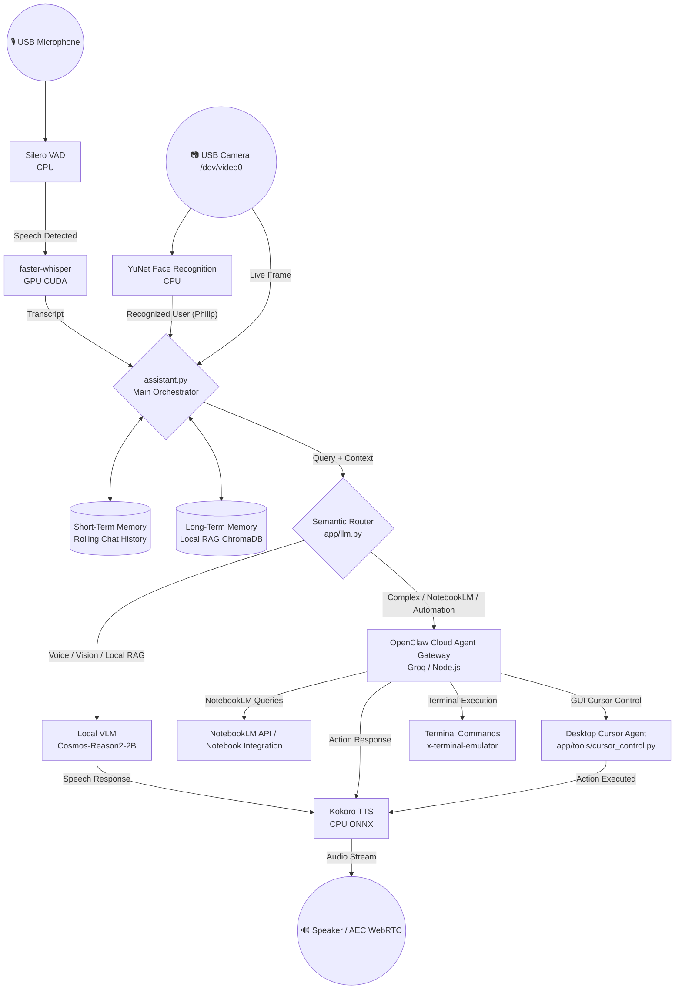

# 🤖 Aria Hybrid AI Assistant — Jetson Orin Nano Super

**Aria** is an autonomous, real-time, multimodal voice and vision assistant designed for edge robotics and desktop automation on the **NVIDIA Jetson Orin Nano (8GB / 67 TOPS)**.

It features a **Hybrid Architecture** combining a **Local VLM Model** for fast voice conversation, optical vision perception, and local RAG memory, with a **Cloud Agent Gateway (OpenClaw)** for complex tasks, NotebookLM querying, terminal execution, and desktop GUI cursor automation.

---

## 🌟 Architecture & System Division

| Layer | System | Device / Technology | Description |
| :--- | :--- | :--- | :--- |
| **Local Model** | Voice Chat & Optical VLM | `Cosmos-Reason2-2B-Q4_K_M` (`llama-server`) | Real-time speech interaction, vision perception (`/dev/video0`), and instant conversational Q&A. |
| **Local RAG** | Vector Store Knowledge Base | `ChromaDB` / `app/rag.py` | Local domain knowledge base querying markdown files in `./knowledge_base/`. |
| **Short-Term Memory**| Rolling Conversation History | Memory Deque (`assistant.py`) | Preserves multi-turn chat context across local and cloud turns. |
| **Long-Term Memory** | User Profile & Permanent Context | `user_profile.md` + Vector Store | Permanent user background and preferences. |
| **Cloud Agent** | OpenClaw Agent Gateway | OpenClaw / Groq Cloud | Complex multi-step reasoning, NotebookLM notebook queries, and cloud tasks. |
| **Desktop Automation**| GUI Cursor & Terminal Control | `pyautogui` / `app/tools/cursor_control.py` | Mouse cursor control, video playback thumbnail clicking, and terminal execution. |
| **Voice Pipelines** | STT & TTS | `faster-whisper` (GPU) + `Kokoro-ONNX` (CPU) | High-speed STT transcription and natural TTS voice synthesis with WebRTC AEC. |

---

## 📊 System Architecture & Data Flow



---

## 🧠 Routing & Memory Logic

1. **Local Model Execution (`LOCAL`)**:
   - **Voice & Chat**: Conversational queries and instant responses.
   - **Optical VLM**: Vision queries (`"vlm"`, `"βλέπεις"`, `"δες"`, `"περιβάλλον"`) attach video frames from `/dev/video0`.
   - **Local Knowledge RAG**: Injects retrieved context from `./knowledge_base/` markdown files.

2. **Cloud Agent Execution (`CLOUD`)**:
   - **NotebookLM Queries**: Connects to NotebookLM to query specific user notebook information.
   - **Desktop Cursor Automation**: Controls the mouse cursor, moves to YouTube video thumbnails, and clicks play.
   - **Terminal Execution**: Spawns terminal windows and runs commands.

---

## 🛑 NVIDIA Jetson Orin Nano Optimizations

- **Memory Gating**: CPU-bound models (`Silero VAD`, `Kokoro TTS`) limited to 1–2 threads (`torch.set_num_threads(1)`).
- **CUDA CTranslate2**: Custom CUDA build for `faster-whisper` on Jetson Ampere GPU.
- **Proxy Bypass**: `trust_env=False` on `httpx.Client` for local socket connections.

---

## ⚙️ Quick Start

```bash
# Clone and start full assistant stack:
./launch_aria.sh
```

- **Dashboard**: `http://localhost:8090`
- **OpenClaw Gateway**: `http://localhost:19000`
- **Local LLM Server**: `http://localhost:8080`
