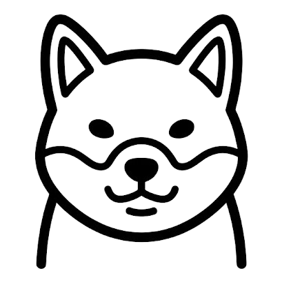
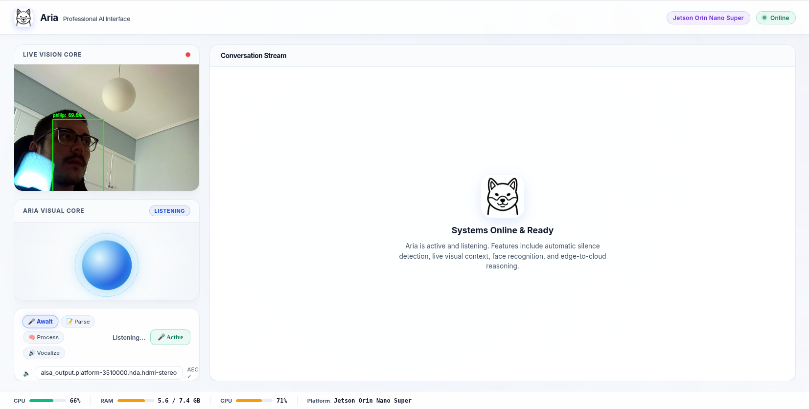
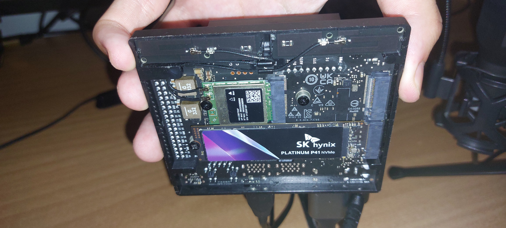
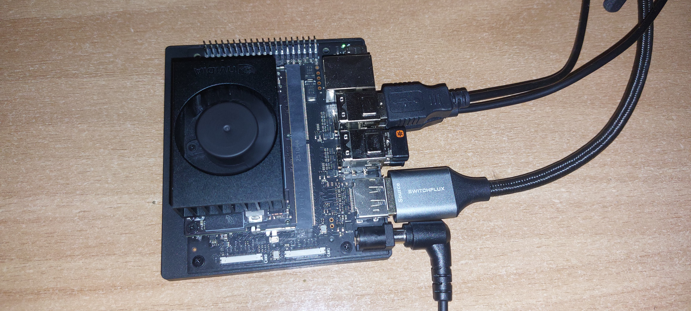
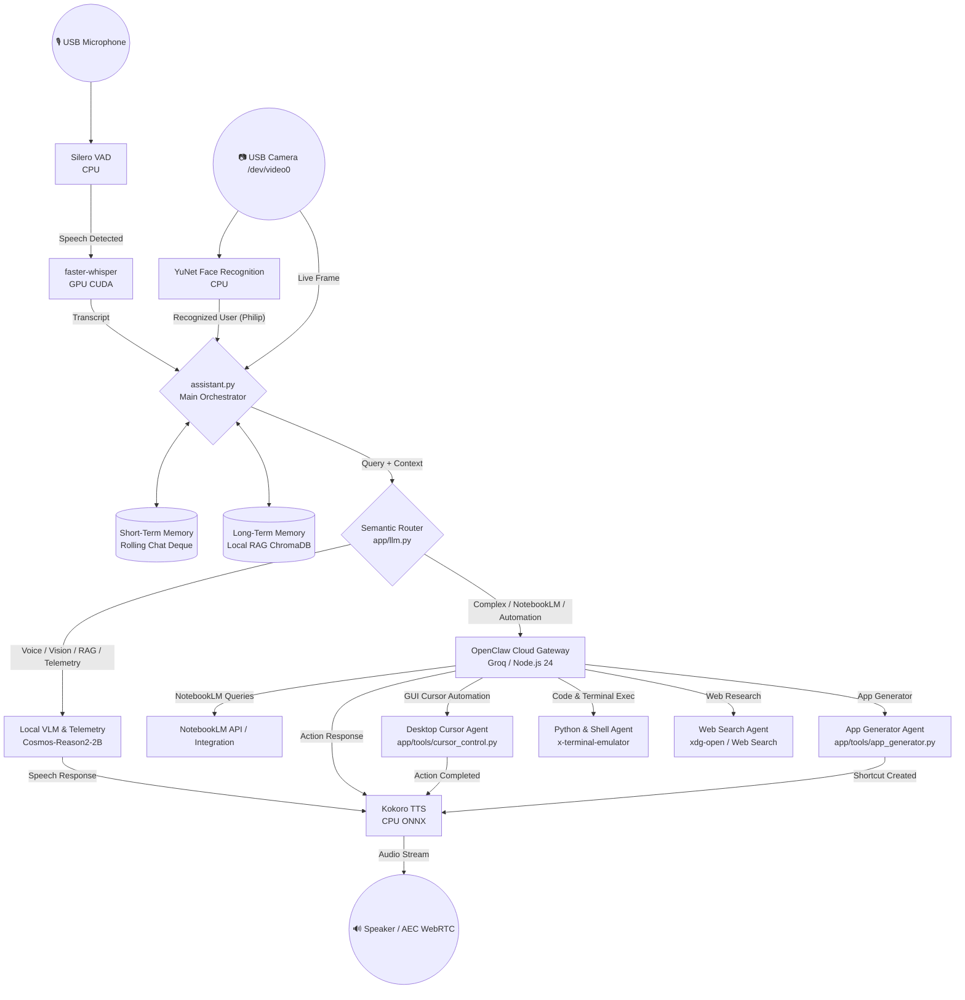

<div align="center">

  

  # 🤖 ARIA AI ASSISTANT 🤖

  ### **Autonomous Multimodal Voice, Vision, RAG & Desktop Automation Agent for NVIDIA Jetson Orin Nano**

  [](https://www.nvidia.com/en-us/autonomous-machines/embedded-systems/jetson-orin/)
  [](#-system-architecture--workflow)
  [](https://www.python.org/)
  [](LICENSE)
  [](https://github.com/FilippeZ)

</div>

---

## 📌 Overview

**ARIA AI ASSISTANT** is a state-of-the-art autonomous, real-time, multimodal voice, vision, local RAG, and desktop automation assistant designed for edge robotics and high-productivity desktop environments on the **NVIDIA Jetson Orin Nano (8GB / 67 TOPS)**.

ARIA combines local on-device neural processing with cloud agentic intelligence in an **Advanced Dual-Core Hybrid Architecture**:

1. **Local Core (`LOCAL`)**: 
   - Real-time voice interaction with GPU-accelerated STT (`faster-whisper`) and CPU-optimized TTS (`Kokoro-ONNX`).
   - Optical vision perception & YuNet facial detection/recognition to identify the owner (**Philip**).
   - Desktop screenshot inspection via local VLM (`Cosmos-Reason2-2B-Q4_K_M`).
   - Real-time system telemetry diagnostics (CPU, RAM, GPU load, thermals).
   - Local Vector RAG using `ChromaDB` for domain-specific knowledge base retrieval.
   - Rolling short-term conversation context deque.

2. **Cloud Core (`CLOUD`)**:
   - Multi-step agentic execution via **OpenClaw Agent Gateway**.
   - Autonomous desktop cursor navigation & PyAutoGUI control (mouse movements, clicks, scrolling, playback).
   - Local GUI Application Generator (`app_generator.py`) creating `.desktop` launchers on-the-fly.
   - NotebookLM deep research querying & structured markdown synthesis.
   - Autonomous web search & browsing agent.
   - Live Python code runner and terminal command execution (`x-terminal-emulator`).

---

## 🖥️ Live Assistant Interface in Action

Here is ARIA AI Assistant running in real-time on desktop with live voice interaction, system status monitoring, and agent execution:

<div align="center">
  
</div>

---

## 🛠️ Hardware Setup & Component Assembly

The physical edge assembly of ARIA on the NVIDIA Jetson Orin Nano developer board:

<div align="center">
  
  
</div>

### Hardware Components Breakdown:
1. **Edge AI Supercomputer:** NVIDIA Jetson Orin Nano Developer Kit (8GB Unified LPDDR5 RAM @ 102 GB/s, 67 TOPS AI performance).
2. **Primary High-Speed Storage:** SK hynix Platinum P41 1TB PCIe NVMe Gen4 SSD mounted via the x4 PCIe Gen3 slot for ultra-fast model weight loading, OS execution, and Docker storage.
3. **Boot & Flashing Setup:** SanDisk 256GB Extreme microSDXC paired with a UGREEN USB 3.0 SD Card Reader for initial Ubuntu/JetPack OS flashing via BalenaEtcher.
4. **Display & Connectivity:** SWITCHFLUX DisplayPort 1.4 to HDMI 2.1 unidirectional adapter cable for desktop GUI output to standard HDMI monitors.

---

## 🖼️ Feature Highlights & Capabilities

### 🎬 1. Desktop GUI & Media Voice Automation
ARIA parses voice commands to control desktop GUI elements via `PyAutoGUI` and `python-xlib`. It can open media platforms (e.g., YouTube), locate UI targets, click buttons, type, and control playback seamlessly.

### ⚡ 2. Autonomous Local Desktop App Generator
Using the built-in `app_generator.py` tool, ARIA can automatically generate local custom GUI applications, shell scripts, and Linux `.desktop` desktop shortcuts on demand for instant executable access.

### 👁️ 3. Optical VLM Camera Perception & Face Recognition
Connects to USB camera devices (`/dev/video0`) to perform real-time YuNet face detection & feature matching (recognizing Philip) alongside local `Cosmos-Reason2-2B` VLM visual scene understanding and live screenshot analysis.

### 📚 4. Cloud Agent NotebookLM & Deep Web Research
Routes complex multi-turn reasoning and research queries through the OpenClaw Cloud Gateway, retrieving notebook knowledge from NotebookLM, performing live web searches, and rendering comparison tables.

### 🧠 5. Local RAG & Jetson Telemetry Monitoring
Performs high-speed vector search against an embedded `ChromaDB` vector store (`./knowledge_base/`) and provides real-time voice updates on CPU, RAM, GPU utilization, and Orin Nano thermals.

---

## 🌟 Technical Stack & Architecture Division

| Layer | System / Tool | Technology Stack | Functional Capabilities |
| :--- | :--- | :--- | :--- |
| **Local VLM Core** | Voice & Vision Engine | `Cosmos-Reason2-2B-Q4_K_M` (`llama-server`) | Voice conversations, live camera perception (`/dev/video0`), desktop screenshot VLM inspection. |
| **Local RAG** | Vector Memory | `ChromaDB` / `app/rag.py` | Local domain knowledge base querying markdown documentation in `./knowledge_base/`. |
| **System Telemetry**| Diagnostics Engine | `psutil` / `app/tools/cursor_control.py` | Real-time monitoring of CPU, RAM, GPU load, and Jetson Orin Nano thermals. |
| **Face Recognition**| Optical Perception | `YuNet` ONNX + OpenCV | Face tracking and biometric identification for Philip. |
| **Short-Term Memory**| Rolling History Buffer | Python Deque Buffer (`assistant.py`) | Preserves multi-turn conversation state across local & cloud turns. |
| **Long-Term Memory**| Permanent Profile | `user_profile.md` + ChromaDB | Stores permanent user background, preferences, and project details. |
| **Cloud Agent** | OpenClaw Gateway | OpenClaw / Groq LLMs | Multi-step agentic execution, NotebookLM queries, and cloud tasks. |
| **Desktop Automation**| GUI Cursor Agent | `PyAutoGUI` / `python-xlib` | Mouse cursor navigation, YouTube video thumbnail clicking, scrolling, typing. |
| **App Generator** | Desktop Creator Tool | `app/tools/app_generator.py` | Spawns custom Tkinter/Python apps and generates `.desktop` shortcuts. |
| **Code & Shell Runner**| Code Execution | `x-terminal-emulator` / Subprocess | Autonomous creation and execution of Python scripts and terminal commands. |
| **Voice Pipeline** | STT & TTS | `faster-whisper` + `Kokoro-ONNX` | Ultra-fast GPU transcription + natural CPU speech synthesis with WebRTC AEC. |

---

## 📊 System Workflow Architecture



---

## 💡 AI Engineering Theory & System Principles

### 1. 🎯 Connection to AI Engineering Principles
The **ARIA** project is constructed strictly according to core **AI Engineering** methodologies:
* **Product → Data → Model Workflow:** ARIA was designed from an interaction-first perspective. Rather than benchmark-chasing, a functional end-to-end voice and vision prototype was created to solve human-computer interaction challenges on Linux desktops, after which model selection, quantization, and system-level load balancing were optimized around hardware boundaries.
* **The AI Stack in Action:**
  * **Infrastructure Layer:** NVIDIA Jetson Orin Nano, 1024-core Ampere GPU, 6-core ARM Cortex-A78AE CPU, 8GB LPDDR5 Unified Memory, and SK hynix Gen4 NVMe SSD.
  * **Model Development & Inference Layer:** 4-bit K-quants quantization, INT8 CUDA acceleration, CTranslate2 speech engines, and dual CPU/GPU model offloading.
  * **Application Layer:** Voice pipeline orchestration, OpenCV optical tracking, local ChromaDB vector RAG, FastAPI Web dashboard, and PyAutoGUI agent desktop tools.
* **Inference Optimization:** Edge devices face stringent memory and compute constraints. ARIA implements **4-bit quantization (`Q4_K_M`)**, **INT8 STT quantization**, **GPU offloading via `llama.cpp` (`NGL=999`)**, **CPU execution for TTS (`Kokoro-ONNX`)**, **16GB NVMe Swap space**, and **CUDA model warmups** to achieve ultra-low latency, reduced power consumption, and reliable offline local execution.
* **Multimodal Foundation Models:** ARIA integrates speech, text, computer vision, and facial biometric tracking into a single unified assistant.

---

### 2. ⚡ Hardware Platform Specifications & Technical Division

#### 🧠 NVIDIA Jetson Orin Nano Architecture
The **NVIDIA Jetson Orin Nano (8GB / 67 TOPS)** acts as an edge AI supercomputer designed to execute deep learning models locally without cloud reliance:

* **Unified Memory Architecture (UMA):** Shares **8GB LPDDR5 RAM** directly between the CPU and GPU with **102 GB/s memory bandwidth**. This eliminates data transfer overhead over traditional PCIe buses.
* **CPU vs. GPU Functional Division:**
  * **CPU (6-core ARM Cortex-A78AE):** Executes the OS, FastAPI server, network IO, **Silero VAD** (32ms audio chunking), **YuNet** face detection, and **Kokoro-ONNX** text-to-speech synthesis. *(Analogous to a fast jumbo jet: highly versatile for sequential logic).*
  * **GPU (1024-core Ampere GPU + 32 Tensor Cores):** Executes parallel matrix operations for **`faster-whisper`** STT and **`Cosmos-Reason2-2B`** VLM visual spatial reasoning. Tensor Cores execute fused matrix multiply-accumulate operations in a single clock cycle. *(Analogous to a massive cargo ship: delivering high parallel throughput).*
* **Dynamic Power Modes (`nvpmodel`):** Hardware power draw can be dynamically scaled using `nvpmodel` from maximum performance (25W) down to battery modes (7W or 15W).

---

### 3. 🧩 Unified Memory Challenge & OOM Protection

Because the CPU (Ubuntu OS & GUI) and GPU share the same 8GB pool, only ~3.5GB to 4GB of RAM remains available for AI models. Running an LLM, STT, TTS, and Face Recognition simultaneously risks triggering the Linux **Out-Of-Memory (OOM) Killer**, which forcibly terminates processes.

#### ARIA's Hardware-Software Mitigations:
1. **NVMe SSD & 16GB Swap File:** ARIA configures a 16GB swap file on the **SK hynix Platinum P41 Gen4 NVMe SSD**. When physical RAM reaches peak allocation, idle pages are rapidly swapped to the high-speed NVMe drive over the PCIe x4 bus, maintaining system stability.
2. **Strict CPU / GPU Load Balancing:** Heavy matrix workloads (`Cosmos-Reason2` VLM & `faster-whisper` STT) are pinned exclusively to the Ampere GPU, while lightweight tasks (`Kokoro` TTS & `YuNet` face tracker) are pinned to the ARM CPU, preserving GPU VRAM.

---

### 4. 🎭 Multimodal AI Model Symphony

To deliver instant voice and vision feedback, ARIA orchestrates a synchronized ensemble of specialized models:

```
                  ┌─────────────────────────────────────────┐
                  │ 🎙️ Microphone Audio Input                │
                  └────────────────────┬────────────────────┘
                                       │
                         ┌─────────────┴─────────────┐
                         │   Silero VAD (CPU 32ms)   │
                         └─────────────┬─────────────┘
                                       │ Speech Detected
                         ┌─────────────┴─────────────┐
                         │ faster-whisper INT8 (GPU) │
                         └─────────────┬─────────────┘
                                       │ Transcript
   ┌───────────────────────────────────┼───────────────────────────────────┐
   │                                   │                                   │
┌──┴──────────────────────┐ ┌──────────┴───────────┐ ┌─────────────────────┴──┐
│  YuNet Face Rec (CPU)   │ │ Cosmos-Reason2 (GPU) │ │ OpenClaw Gateway (Cloud)│
│  Biometric Identity     │ │ Physical Perception │ │ Agent & Cursor Tools    │
└──┬──────────────────────┘ └──────────┬───────────┘ └─────────────────────┬──┘
   │                                   │                                   │
   └───────────────────────────────────┼───────────────────────────────────┘
                                       │ Response Text
                         ┌─────────────┴─────────────┐
                         │  Kokoro-ONNX TTS (CPU)    │
                         └─────────────┬─────────────┘
                                       │ Audio Stream
                  ┌────────────────────┴────────────────────┐
                  │ 🔊 Speaker Output (WebRTC AEC)           │
                  └─────────────────────────────────────────┘
```

#### Detailed Subsystem Architecture:
1. **Brain (Vision & Reasoning - `Cosmos-Reason2-2B-Q4_K_M`):**
   - 2-Billion parameter Vision-Language Model compressed via **4-bit K-quants (`Q4_K_M`)**, reducing VRAM footprints from ~5GB down to **1.2GB**.
   - Executed via `llama-server` (C/C++) with `NGL=999` to lock 100% of neural layers to the Ampere GPU, achieving a Time-To-First-Token (TTFT) of **~0.3s**.
   - Uses a multimodal projector (`mmproj`) to map camera pixels directly into LLM token embeddings.
2. **Hearing (Speech-to-Text - `faster-whisper small`):**
   - Operates on CUDA GPU using INT8 CTranslate2 quantization for **4x speedup**.
   - **ARM64 Architecture Bug Fix:** Locked to GPU execution because CTranslate2 exhibits a known **SGEMM (Single-Precision General Matrix Multiply) bug** on ARM64 Cortex-A78AE CPUs that causes silent matrix multiplication failures.
3. **Voice (Text-to-Speech - `Kokoro-ONNX` - Voice: `af_sarah`):**
   - 82M parameter TTS model running on ARM CPU (`CPUExecutionProvider`), saving 1.5GB VRAM.
   - **GPL License Isolation:** Pinned to a separate worker process (`tts_worker.py`) to maintain strict process-level separation between open-source GPL components (`espeak-ng`) and NVIDIA's closed-source CUDA libraries.
   - **Audio Buffering:** Synthesizes audio in 8-word sentence chunks to ensure smooth speech playback without stuttering.
4. **Attention (Voice Activity Detection - `Silero VAD`):**
   - Lightweight VAD model running on CPU analyzing 32ms audio chunks (512 samples) in under 1ms.
   - Paired with **WebRTC Acoustic Echo Cancellation (AEC)** to digitally subtract ARIA's TTS speaker output from the microphone stream.

---

### 5. 🤖 OpenClaw: 24/7 Agentic Execution Layer
**OpenClaw** operates as a continuous background daemon (Node.js Gateway) providing autonomous agentic capabilities:
* **24/7 Background Agency:** Continuously runs as a system daemon executing background tasks, tool calls, and scheduled Cron jobs.
* **Autonomous Skillset & Tools:** Connects the LLM to local shell execution, desktop GUI cursor navigation, web search engines, Python code execution, and NotebookLM deep research.
* **Messaging Integration:** Supports remote messaging bridges (e.g., Telegram / WhatsApp) to query your Jetson assistant remotely.
* **Hybrid Load Balancing:** Delegates heavy agent reasoning (16k+ prompt tokens) to cloud gateways (e.g., Groq / Llama 3 70B) while keeping voice and vision processing local, ensuring zero latency degradation on the Jetson Orin Nano.

---

## 📂 Codebase Architecture & File Analysis

```
aria-ai-assistant/
├── app/
│   ├── audio.py                # PyAudio recording & WebRTC AEC processing
│   ├── camera.py               # OpenCV camera capturing & image encoding
│   ├── cli.py                  # CLI user interface & interactive chat
│   ├── config.py               # System environment variables & settings
│   ├── face_detector.py        # YuNet face detector wrapper
│   ├── face_recognition.py     # Biometric face identification & model downloader
│   ├── llm.py                  # Hybrid local/cloud LLM routing & API handling
│   ├── monitor.py              # System load & thermal diagnostics engine
│   ├── pipeline.py             # Audio/Video execution pipeline & stream_and_speak
│   ├── rag.py                  # ChromaDB vector RAG implementation
│   ├── stt.py                  # GPU faster-whisper speech transcription & warmup
│   ├── tts.py                  # Kokoro-ONNX speech synthesizer
│   ├── tts_worker.py           # Async worker for audio playback queue (GPL Isolation)
│   ├── vision_capture.py       # Live screen & webcam image capture
│   ├── web.py                  # Web dashboard UI server (FastAPI/WebSocket)
│   └── tools/
│       ├── app_generator.py    # Desktop GUI app & .desktop shortcut generator
│       └── cursor_control.py   # PyAutoGUI mouse navigation & web search query cleaning
├── config/
│   └── settings.yaml           # Core system prompts, thresholds & model paths
├── knowledge_base/
│   ├── jetson_orin_nano.md     # Jetson hardware documentation for RAG
│   └── user_profile.md         # Permanent user profile for Philip
├── static/                     # Web dashboard assets, images, & logos
│   ├── aria.png
│   ├── hardware_setup_1.jpg    # Hardware assembly photo 1
│   ├── hardware_setup_2.jpg    # Hardware assembly photo 2
│   ├── aria_live_usage.png     # Live UI screenshot
│   └── index.html              # Modern web control panel UI
├── assistant.py                # Main orchestrator loop & multi-threaded manager
├── launch_aria.sh              # Master launch script for all services
├── create_desktop_shortcut.sh  # Generator for Linux desktop entry
├── run_llama_cpp.sh            # GGUF model runner wrapper
├── requirements.txt            # Python dependencies
└── README.md                   # Project documentation
```

### Module Responsibilities:
* **`assistant.py` (Master Orchestrator):** Controls system lifecycle, VAD loop handling, and background threads (`_stats_thread` for telemetry, `_frame_thread` for live web camera streaming, `_face_monitor_thread` for proactive user greetings with a 10-hour cooldown).
* **`app/pipeline.py` (Audio Pipeline):** Manages PyAudio microphone streams, WebRTC Acoustic Echo Cancellation (AEC), and chunked real-time sentence streaming (`stream_and_speak`).
* **`app/stt.py` (Speech Transcription):** Handles GPU-accelerated `faster-whisper` speech-to-text inference with INT8 quantization, fallback handling, and CUDA tensor initialization.
* **`app/face_recognition.py` (Face Perception & Recognition):** Executes YuNet face detection and 128D OpenFace feature extraction for biometric identification of Philip against saved reference embeddings.
* **`app/web.py` (Web Dashboard Server):** Operates FastAPI on port 8090 with WebSockets to stream live camera feeds, real-time transcripts, push-to-talk (PTT) state, and system performance telemetry (CPU/RAM/GPU).

---

## ⚙️ Installation & Quick Start

### 1. Prerequisites
- **Hardware:** NVIDIA Jetson Orin Nano (8GB / 67 TOPS) or Linux x86_64 system with CUDA support.
- **OS:** Ubuntu 22.04 LTS / JetPack 6.x.
- **Environment:** Python 3.10+, Node.js 24+, CUDA 12.x, `llama-server`.

### 2. Quick Start
Clone the repository and launch the full ARIA assistant stack:

```bash
# Clone the repository
git clone https://github.com/FilippeZ/aria-ai-assistant.git
cd aria-ai-assistant

# Make scripts executable and launch ARIA
chmod +x launch_aria.sh run_llama_cpp.sh start.sh
./launch_aria.sh
```

### 3. Active Endpoints & Services
When running, ARIA exposes the following local interfaces:

| Service | Address / Port | Description |
| :--- | :--- | :--- |
| **Web Dashboard** | `http://localhost:8090` | Interactive web control panel & status view |
| **OpenClaw Gateway** | `http://localhost:19000` | Cloud agent bridge server |
| **Local LLM API** | `http://localhost:8080` | Local `llama-server` GGUF endpoint |

---

## 🗣️ Voice Commands & Example Prompting

### 🔹 Local Diagnostic & Vision Queries
- *"Aria, system status"* → Returns real-time CPU/GPU load, RAM usage, and temperatures.
- *"Aria, what is on my screen right now?"* → Takes desktop screenshot and analyzes contents with VLM.
- *"Aria, who am I?"* → Recognizes Philip via face perception and local user profile RAG.

### 🔹 Cloud Agent & Desktop Automation
- *"Aria, open YouTube and search for Jetson Orin Nano tutorials"* → Controls browser and mouse cursor autonomously.
- *"Aria, create a desktop app for calculating fast Fourier transforms"* → Generates Python GUI app and desktop launcher icon.
- *"Aria, use NotebookLM to analyze my research notes on neural interfaces"* → Queries NotebookLM and returns a structured comparison table.

---

## 📄 License

This project is licensed under the **Apache License 2.0**. See the [LICENSE](LICENSE) file for full details.

---

<div align="center">

**Developed with ❤️ by [Philip (FilippeZ)](https://github.com/FilippeZ)**

</div>
