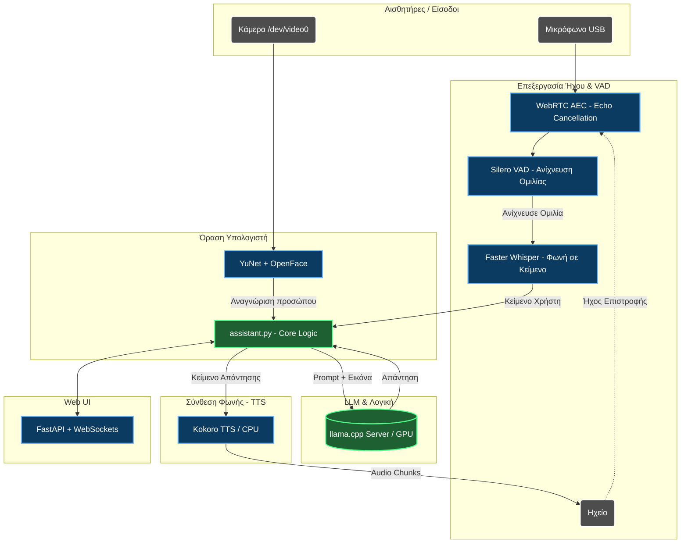

# 🤖 Aria (Reachy Mini Jetson Assistant)

Καλώς ήρθατε στο repository της **Aria**, ενός 100% τοπικού (Local AI) Φωνητικού Βοηθού με δυνατότητες Τεχνητής Όρασης, ειδικά σχεδιασμένου και βελτιστοποιημένου για το **NVIDIA Jetson Orin Nano (8GB)**.

## 🚀 Στόχος & Αρχιτεκτονική
Στόχος του project είναι η δημιουργία ενός έξυπνου ρομπότ/βοηθού που μπορεί ταυτόχρονα να:
- **Ακούει** (Μέσω USB Μικροφώνου)
- **Βλέπει και Αναγνωρίζει** (Μέσω κάμερας, εντοπίζει συγκεκριμένα πρόσωπα π.χ. "Philip")
- **Σκέφτεται** (Μέσω VLM/LLM για λογική και απαντήσεις)
- **Μιλάει** (Μέσω Text-to-Speech)

### 📊 Διάγραμμα Ροής Λειτουργίας
Η αρχιτεκτονική χωρίζεται σε ανεξάρτητα υποσυστήματα που συνεργάζονται αρμονικά:



---

## 🛑 Προβλήματα & "Μυστικά" Επίλυσης στο Jetson Orin Nano

Το NVIDIA Jetson Orin Nano έχει **8GB Ενιαίας Μνήμης (Unified Memory)**. Από προεπιλογή, το λειτουργικό περιορίζει την GPU στο να δεσμεύσει περίπου **3.5GB - 4GB**. 
Καθώς προσπαθήσαμε να φορτώσουμε ΌΛΑ τα μοντέλα Τεχνητής Νοημοσύνης, αντιμετωπίσαμε το σφάλμα `Out Of Memory (OOM)` και `Connection Refused` γιατί ο LLM Server έκλεινε σιωπηλά (crashed).

**Πώς το λύσαμε:**
1. **Διαμοιρασμός Μνήμης (CPU vs GPU):**
   Κρατήσαμε στην **GPU** μόνο ό,τι χρειαζόταν απόλυτα επιτάχυνση (το **LLM Cosmos 2B** και το **faster-whisper STT**). 
   Μεταφέραμε το σύστημα φωνής **Kokoro TTS** και το **Silero VAD** αποκλειστικά στον **6-πύρηνο ARM CPU**. Αυτό εξοικονόμησε ~1.5GB VRAM!
2. **SGEMM Bug στο Jetson:**
   Δοκιμάσαμε αρχικά να βάλουμε και το STT (Whisper) στον CPU. Ωστόσο, η βιβλιοθήκη `CTranslate2` δεν υποστηρίζει υπολογισμούς SGEMM σε ARM64, οδηγώντας σε σιωπηλή αποτυχία αναγνώρισης φωνής. Γι' αυτό το STT **πρέπει** να τρέχει στην GPU.
3. **Ήχος & Stuttering (Διακοπές Φωνής):**
   Επειδή το TTS μεταφέρθηκε στον επεξεργαστή, ήταν οριακά πιο αργό από τον πραγματικό χρόνο. Για να λύσουμε τα "σπασίματα" (audio under-run), αυξήσαμε το **buffering** (`first_chunk_words: 8` στο `settings.yaml`), ώστε να σχηματίζεται πρώτα μια ολόκληρη φράση πριν ξεκινήσει η ομιλία. Το LLM έχει TTFT (Time To First Token) μόλις 0.3s!
4. **Ακύρωση Ηχούς (AEC):**
   Εφαρμόστηκε WebRTC για να μην "ακούει" η Aria την ίδια της τη φωνή από τα ηχεία.

---

## 🖥️ Υλικό & Στήσιμο (Jetson Orin Nano Setup)

Η Aria τρέχει πάνω στο **NVIDIA Jetson Orin Nano (8GB)**. Πρόκειται για έναν πανίσχυρο "υπολογιστή ακμής" (Edge AI computer) με απόδοση 67 TOPS, 6-πύρηνο ARM Cortex-A78AE επεξεργαστή, και 8GB LPDDR5 Unified Memory.

Επειδή τα 8GB RAM είναι οριακά για να τρέξουν ταυτόχρονα VLM, STT, TTS, VAD και Face Recognition, κάναμε **συγκεκριμένες βελτιστοποιήσεις σε επίπεδο λειτουργικού (OS)**:

### 1. Απενεργοποίηση του Desktop (Headless Mode)
Το γραφικό περιβάλλον (Ubuntu Desktop / GNOME) καταναλώνει περίπου 800MB - 1GB RAM από μόνο του! Για να ελευθερώσουμε αυτή τη μνήμη, τρέχουμε το Jetson σε **Headless Mode** (χωρίς γραφικό περιβάλλον στην οθόνη):
```bash
# Απενεργοποίηση του Desktop για εξοικονόμηση ~800MB RAM
sudo systemctl set-default multi-user.target
```
*(Αν ποτέ χρειαστείτε ξανά το γραφικό περιβάλλον, το επαναφέρετε με `sudo systemctl set-default graphical.target`)*

### 2. Χρήση NVMe SSD & Ενεργοποίηση Swap
Επειδή η μνήμη RAM (8GB) γεμίζει εύκολα όταν φορτώνονται τα μοντέλα, είναι ΑΠΑΡΑΙΤΗΤΟ να έχουμε **εικονική μνήμη (Swap) πάνω σε γρήγορο δίσκο (NVMe SSD)**.
* **NVMe SSD**: Προσθέσαμε έναν M.2 NVMe SSD. Το λειτουργικό (L4T) και τα Docker Containers έχουν ρυθμιστεί να αποθηκεύονται εκεί (`/ssd/docker`) για μέγιστη ταχύτητα (Data Root Directory: `/ssd/docker`).
* **ZRAM & 16GB Swap**: Απενεργοποιήσαμε το ενσωματωμένο ZRAM και δημιουργήσαμε ένα μεγάλο Swap αρχείο 16GB πάνω στον NVMe SSD, ώστε να μην "κρασάρει" ποτέ το σύστημα αν υπάρξει στιγμιαία κορύφωση στη χρήση μνήμης.
```bash
sudo fallocate -l 16G /ssd/16GB.swap
sudo mkswap /ssd/16GB.swap
sudo swapon /ssd/16GB.swap
```

---

## 📁 Τι κάνει το κάθε αρχείο (Components)

*   **`start.sh` & `launch_aria.sh`**: 
    Τα scripts εκκίνησης. Ελέγχουν και ανοίγουν τον Docker Container του LLM (`assistant-llm`) και στη συνέχεια φορτώνουν το κεντρικό πρόγραμμα της Aria.
*   **`assistant.py`**: 
    Ο "Μαέστρος". Ενώνει όλα τα υποσυστήματα. Περιέχει το κεντρικό loop ελέγχου, διαβάζει τα δεδομένα ήχου και εικόνας, στέλνει τα μηνύματα στο LLM και περιμένει απαντήσεις.
*   **`app/pipeline.py`**: 
    Διαχειριστής Ροής Ήχου. Ελέγχει το Μικρόφωνο, εφαρμόζει την ακύρωση ηχούς (AEC), και τρέχει το Silero VAD (σε CPU) για να καταλαβαίνει πότε μιλάς.
*   **`app/stt.py`**: 
    (Speech-To-Text) Φορτώνει το `faster-whisper` στην GPU. Μετατρέπει την φωνή σου σε κείμενο μέσα σε 1 δευτερόλεπτο.
*   **`app/tts_worker.py`**: 
    (Text-To-Speech) Φορτώνει το Kokoro-ONNX σε ανεξάρτητο διεργασιακό "worker". Έχει ρυθμιστεί αποκλειστικά σε `CPUExecutionProvider` για να αφήνει ελεύθερη την GPU.
*   **`app/llm.py`**: 
    Ο πελάτης (client) που επικοινωνεί μέσω HTTP με τον server του `llama.cpp`. Παραλαμβάνει το κείμενο απάντησης λέξη-λέξη (streaming).
*   **`app/face_recognition.py`**: 
    Χρησιμοποιεί τον αλγόριθμο **YuNet** για να εντοπίσει πρόσωπα, και στη συνέχεια εξάγει χαρακτηριστικά προσώπου για να αναγνωρίσει τον χρήστη (π.χ. "Philip") ώστε να του πει μια προσωποποιημένη καλημέρα.
*   **`app/web.py`**: 
    Ένας τοπικός διακομιστής FastAPI. Προσφέρει μια όμορφη Web Διεπαφή που τρέχει στο `http://0.0.0.0:8090` όπου βλέπεις ό,τι βλέπει η κάμερα και όσα λέγονται σε πραγματικό χρόνο.
*   **`config/settings.yaml`**: 
    Το κέντρο ρυθμίσεων. Εδώ ρυθμίζονται τα chunks του TTS, το System Prompt (η "προσωπικότητα" της Aria), και οι ευαισθησίες του VAD.
*   **`run_llama_cpp.sh`**: 
    Το script που ρυθμίζει τον LLM Server (llama-server) να τρέχει με `NGL=999` (πλήρως στην κάρτα γραφικών) για μέγιστη απόδοση.

## 🧠 Μοντέλα Τεχνητής Νοημοσύνης (AI Models)

Για να πετύχουμε τέλεια ισορροπία μεταξύ ταχύτητας και ποιότητας (λόγω των 8GB RAM), επιλέξαμε τα εξής μοντέλα:

1. **LLM / VLM: Cosmos-Reason2-2B-Q4_K_M.gguf**
   * **Γιατί επιλέχθηκε:** Πρόκειται για ένα υπερ-συμπιεσμένο (Quantized σε 4-bit) αλλά εξαιρετικά "έξυπνο" γλωσσικό μοντέλο 2 δισεκατομμυρίων παραμέτρων. Το τεράστιο πλεονέκτημά του είναι ότι **καταλαμβάνει μόλις 1.2GB μνήμης (VRAM)**. 
   * **Λειτουργία:** Εκτός από συζήτηση, υποστηρίζει Όραση (Vision), επιτρέποντας στην Aria να βλέπει την κάμερα και να περιγράφει τον κόσμο γύρω της ταχύτατα (TTFT: ~0.3 δευτερόλεπτα).
2. **STT (Speech-to-Text): faster-whisper (small)**
   * Γρήγορο και αξιόπιστο μοντέλο από την OpenAI για ακριβή απομαγνητοφώνηση.
3. **TTS (Text-to-Speech): Kokoro ONNX**
   * Προσφέρει υπερ-ρεαλιστική φωνή (`af_sarah`) που ακούγεται εντελώς φυσικά, σε αντίθεση με ρομποτικές φωνές τύπου eSpeak.
4. **VAD (Voice Activity Detection): Silero**
   * Εντοπίζει ακριβώς πότε ξεκινάει και πότε σταματάει η ομιλία για να μην υπάρχουν άβολες παύσεις.

---

## ⚙️ Εγκατάσταση (Από την αρχή)

Αν θελήσετε να στήσετε την Aria σε ένα νέο Jetson Orin Nano, ακολουθήστε αυτά τα βήματα:

### 1. Εγκατάσταση Απαιτήσεων Συστήματος
```bash
sudo apt-get update
sudo apt-get install -y python3.10-venv portaudio19-dev libasound2-dev pulseaudio-utils libcudnn9-dev-cuda-12
```

### 2. Δημιουργία Python Virtual Environment
```bash
python3.10 -m venv venv
source venv/bin/activate
pip install --upgrade pip wheel
pip install -r requirements.txt
```

### 3. Εγκατάσταση ONNX Runtime (GPU) & Reachy SDK
```bash
pip install onnxruntime-gpu --extra-index-url https://pypi.jetson-ai-lab.io/jp6/cu126
pip install reachy-mini
pip install "numpy==1.26.4"
```

### 4. Χτίσιμο του CTranslate2 με υποστήριξη CUDA (Gia to STT)
Το Whisper (STT) απαιτεί το CTranslate2 να έχει χτιστεί με υποστήριξη GPU, αλλιώς το Jetson "σκάει" λόγω ελλείψεων της CPU (SGEMM bug).
```bash
pip install pybind11
git clone --depth 1 https://github.com/OpenNMT/CTranslate2.git
cd CTranslate2 && git submodule update --init --recursive
mkdir build && cd build
export PATH=/usr/local/cuda/bin:$PATH
export CUDA_HOME=/usr/local/cuda
cmake .. -DWITH_CUDA=ON -DWITH_CUDNN=ON -DCMAKE_BUILD_TYPE=Release -DCUDA_ARCH_LIST="8.7" -DOPENMP_RUNTIME=NONE -DWITH_MKL=OFF
make -j$(nproc)
cmake --install . --prefix ~/.local
cd ../python && pip install .
```
*(Μην ξεχάσετε να προσθέσετε το `export LD_LIBRARY_PATH=$HOME/.local/lib:$LD_LIBRARY_PATH` στο `venv/bin/activate`!)*

---

## ▶️ Πώς το τρέχω;

Έχετε δύο επιλογές για να ξεκινήσετε την Aria:

### Επιλογή 1: Εικονίδιο Επιφάνειας Εργασίας (Προτείνεται)
Στην Επιφάνεια Εργασίας έχει δημιουργηθεί το εικονίδιο **Aria Assistant**. 
1. Κάντε διπλό κλικ στο εικονίδιο.
2. Θα ανοίξει αυτόματα ένα τερματικό που θα σηκώσει τον LLM Server (Docker) και το κεντρικό σύστημα της Aria (`assistant.py`).
3. Αν θέλετε να την κλείσετε, απλά **κλείστε το παράθυρο** ή πατήστε `Ctrl+C`.

### Επιλογή 2: Μέσω Τερματικού (Για προχωρημένους)
```bash
cd ~/reachy-mini-jetson-assistant
./launch_aria.sh
```

---

## 🌐 Web UI & Ζωντανή Παρακολούθηση

Η Aria διαθέτει ένα εντυπωσιακό Web Interface που σας επιτρέπει να βλέπετε "μέσα από τα μάτια της". 
Όταν τρέξει η εφαρμογή, ανοίξτε οποιονδήποτε browser (ακόμα και από το κινητό σας αν είστε στο ίδιο WiFi) και μπείτε στο:
👉 **http://<IP_ΤΟΥ_JETSON>:8090** (π.χ. `http://0.0.0.0:8090`)

**Από το Web UI μπορείτε να:**
* Βλέπετε Live την Κάμερα (με ενδείξεις για το Face Recognition).
* Διαβάζετε το Live Transcript (τι ακούει και τι λέει).
* Παρακολουθείτε το Τηλεμετρικό Σύστημα (Χρήση CPU, RAM, VRAM GPU).
* Βλέπετε ποια μοντέλα (VAD, TTS, STT) είναι ενεργά εκείνη τη στιγμή.

---

## 📚 Σύστημα Γνώσης (RAG - Retrieval-Augmented Generation)
Ο κώδικας περιλαμβάνει και έναν φάκελο `knowledge_base/`. Αυτός επιτρέπει στην Aria να **διαβάζει δικά σας PDF ή κείμενα** και να τα θυμάται όταν σας απαντάει!
*Για την ώρα η λειτουργία αυτή είναι **απενεργοποιημένη** στο `settings.yaml` (`knowledge_base: enabled: false`) για εξοικονόμηση μνήμης. Αν βάλετε μεγαλύτερο LLM ή έχετε παραπάνω RAM, μπορείτε να το ενεργοποιήσετε!*

---

## 🛠️ Αντιμετώπιση Προβλημάτων (Troubleshooting)

* **"No audio outputs" / Ήχος που δεν ακούγεται:** Σιγουρευτείτε ότι έχετε ρυθμίσει σωστά το default ηχείο στο Ubuntu (PulseAudio). Η Aria διαβάζει τα διαθέσιμα Sinks του λειτουργικού.
* **Η φωνή σπάει (Stuttering):** Ανοίξτε το `config/settings.yaml` και αυξήστε το `first_chunk_words: 8` σε `10` ή `12`.
* **Out Of Memory (OOM) Errors:** Σημαίνει ότι η κάρτα γραφικών γέμισε. Βεβαιωθείτε ότι δεν έχετε ανοιχτά άλλα βαριά προγράμματα, κλείστε το Ubuntu Desktop (Headless Mode) και βεβαιωθείτε ότι το Docker Container του LLM τρέχει την Q4 έκδοση του μοντέλου!
* **Το μικρόφωνο δεν πιάνει ήχο:** Ελέγξτε τις ρυθμίσεις του `pavucontrol`. Το Silero VAD χρειάζεται σχετικά καθαρό ήχο για να ξεχωρίσει τη φωνή από τον θόρυβο. Προσαρμόστε το `vad_threshold` στο `settings.yaml`.

---

*Σχεδιάστηκε με ❤️ για το NVIDIA Jetson Orin Nano.*
