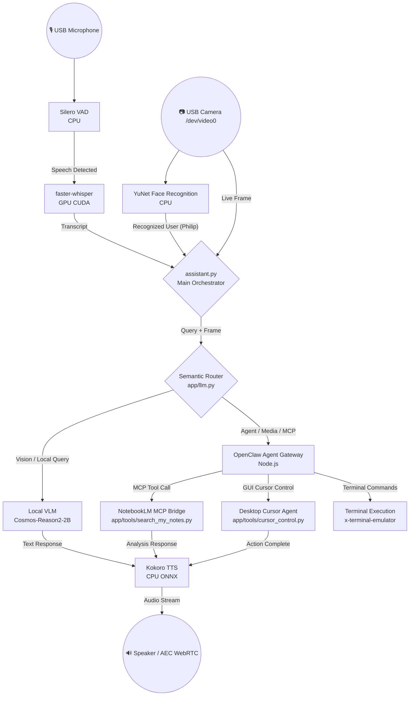

# 🤖 Aria Hybrid AI Assistant — Jetson Orin Nano Super

**Aria** is an autonomous, real-time, multimodal voice and vision assistant designed for edge robotics and desktop automation on the **NVIDIA Jetson Orin Nano (8GB / 67 TOPS)**. 

It combines **Local Optical VLM Perception**, **Fast Voice STT/TTS Pipelines**, and a **Hybrid Semantic Router** connected to the **OpenClaw Agent Gateway** with full desktop GUI cursor control, terminal execution, and NotebookLM MCP integration.

---

## 🌟 Key Features & Core Systems

| Subsystem | Technology | Execution Device | Description |
| :--- | :--- | :--- | :--- |
| **Local VLM / LLM** | `Cosmos-Reason2-2B-Q4_K_M` (`llama-server`) | GPU (CUDA / Tensor cores) | 2B VLM/LLM for fast local streaming, vision analysis, and semantic routing. |
| **Speech-to-Text (STT)** | `faster-whisper` (small model) | GPU (CUDA CTranslate2) | Ultra-fast real-time transcription of voice input from USB microphone. |
| **Text-to-Speech (TTS)** | `Kokoro-ONNX` (`af_sarah` voice) | CPU (2 Threads) | High-fidelity, natural voice synthesis with WebRTC Acoustic Echo Cancellation (AEC). |
| **Voice Activity Detection**| `Silero VAD` (ONNX) | CPU (1 Thread) | Low-latency voice activity gating. |
| **Vision Perception** | `YuNet` + `OpenFace` (`/dev/video0`) | CPU / OpenCV | Face detection and recognition (personalized greeting for user Philip) + VLM scene understanding. |
| **Agentic Core** | `OpenClaw Gateway` | Node.js / Hybrid Cloud | Task automation, browser automation, WhatsApp messaging, and terminal agent. |
| **MCP Integration** | `FastMCP` (`search_my_notes.py`) | Python | MCP bridge connecting OpenClaw Agent to NotebookLM for document reading. |
| **GUI Cursor Automation**| `pyautogui` / Desktop Control | Display / Cursor | Mouse cursor movement, video playback clicking, and terminal execution. |
| **Long-Term Memory** | `ChromaDB` (Local RAG) | CPU / RAM | Vector store for reading files from `./knowledge_base/`. |

---

## 📊 System Architecture & Routing Flow



---

## 🧠 Semantic Routing Matrix

Aria dynamically classifies every user prompt using a zero-overhead semantic decision engine:

1. **`LOCAL` (Optical VLM / Local Chat)**:
   - **Triggers**: Vision keywords (`"vlm"`, `"see"`, `"look"`, `"βλέπεις"`, `"δες"`, `"περιβάλλον"`), conversational queries (`"hello"`, `"who are you"`).
   - **Action**: Captures live camera frame from `/dev/video0` and processes inference locally via `Cosmos-Reason2-2B` GGUF.

2. **`CLOUD` (OpenClaw Agent + Desktop Automation)**:
   - **Triggers**: Action queries (`"play a song"`, `"open youtube"`, `"use notebooklm"`, `"write a program"`, `"run command"`).
   - **Action**: 
     - **Media/YouTube**: Invokes `cursor_control.py` to move the mouse cursor, click YouTube video thumbnails, and play audio.
     - **NotebookLM / Files**: Invokes FastMCP `search_my_notes.py` tool to search and read notebooks.
     - **Terminal**: Spawns terminal window and executes commands autonomously.

---

## 🛑 NVIDIA Jetson Orin Nano Super Optimizations

Running a multi-modal agent stack on **7.4 GB Unified RAM** requires strict resource management:

1. **VRAM Offloading & CPU Thread Pinning**:
   - `llama-server` runs with `CTX=2048` and controlled GPU layer offloading.
   - CPU-bound models (`Silero VAD`, `Kokoro TTS`) use explicit thread pinning (`torch.set_num_threads(1)`, `intra_op_num_threads=2`) to prevent system freeze (keeping load average < 3.0).
2. **CTranslate2 CUDA Compilation**:
   - `faster-whisper` uses a custom CTranslate2 build compiled specifically for CUDA Compute Capability `8.7` (Orin Nano Ampere GPU).
3. **No-Proxy Direct Socket Routing**:
   - `httpx.Client` calls enforce `trust_env=False` and `NO_PROXY=localhost,127.0.0.1` to eliminate HTTP proxy latency on internal 8080/19000 endpoints.
4. **Node.js Compile Cache**:
   - `NODE_COMPILE_CACHE` enabled for OpenClaw Gateway to minimize V8 JIT CPU overhead.

---

## 📁 Repository Structure

```
.
├── launch_aria.sh               # Main multi-service launcher (LLM, OpenClaw, Pipeline)
├── start.sh                     # Python environment runner
├── assistant.py                 # Core main loop (VAD, Vision, Audio, Routing)
├── test_usecases.py             # Automated verification suite for Use Cases 1, 2, 3
├── app/
│   ├── config.py                # Configuration loader (settings.yaml)
│   ├── llm.py                   # OpenClawLLM & Semantic Router implementation
│   ├── pipeline.py              # Audio recording ring buffer & WebRTC AEC
│   ├── stt.py                   # GPU faster-whisper STT integration
│   ├── tts.py                   # CPU Kokoro ONNX TTS integration
│   ├── camera.py                # V4L2 Camera ring buffer (/dev/video0)
│   ├── face_recognition.py      # YuNet face detector + OpenFace recognizer
│   ├── rag.py                   # Vector Store RAG for local documents
│   ├── web.py                   # FastAPI telemetry dashboard & live video stream
│   └── tools/
│       ├── search_my_notes.py   # FastMCP server for NotebookLM document querying
│       └── cursor_control.py    # PyAutoGUI desktop cursor & GUI automation helper
├── config/
│   └── settings.yaml            # System thresholds, model paths, audio settings
└── knowledge_base/              # Permanent Markdown notebooks & user profile
```

---

## ⚙️ Installation & Setup Guide

### 1. Prerequisites (JetPack 6.x / Ubuntu 22.04 LTS)
```bash
sudo apt-get update
sudo apt-get install -y python3.10-venv portaudio19-dev libasound2-dev pulseaudio-utils libcudnn9-dev-cuda-12 xdotool
```

### 2. Virtual Environment Setup
```bash
python3.10 -m venv venv
source venv/bin/activate
pip install --upgrade pip wheel
pip install -r requirements.txt
pip install pyautogui python-xlib
```

### 3. OpenClaw Gateway Configuration
Ensure `~/.openclaw/openclaw.json` registers the `aria_notes` MCP tool and allows execution profile:
```json
{
  "mcp": {
    "servers": {
      "aria_notes": {
        "command": "/home/filippos/reachy-mini-jetson-assistant/venv/bin/python",
        "args": ["/home/filippos/reachy-mini-jetson-assistant/app/tools/search_my_notes.py"]
      }
    }
  },
  "tools": { "profile": "full" }
}
```

---

## ▶️ Running the Assistant

Simply run the master launcher:
```bash
./launch_aria.sh
```

This will automatically:
1. Check & start `llama-server` (Port `8080`).
2. Start `openclaw gateway` in background (Port `19000`).
3. Start the FastAPI Web Dashboard (Port `8090`).
4. Initialize Camera `/dev/video0`, STT, TTS, and VAD audio loops.

### Live Telemetry Web Dashboard
Access the dashboard in your browser: `http://<jetson-ip>:8090` (or `http://localhost:8090`).

---

## 📜 License & Acknowledgments

- Built for **NVIDIA Jetson Orin Nano Super**.
- Powered by `llama.cpp`, `OpenClaw Agent Gateway`, `Kokoro TTS`, `faster-whisper`, `FastMCP`, and `YuNet`.
- Designed & Developed by **Filippos (Philip)** — AI Engineer.
